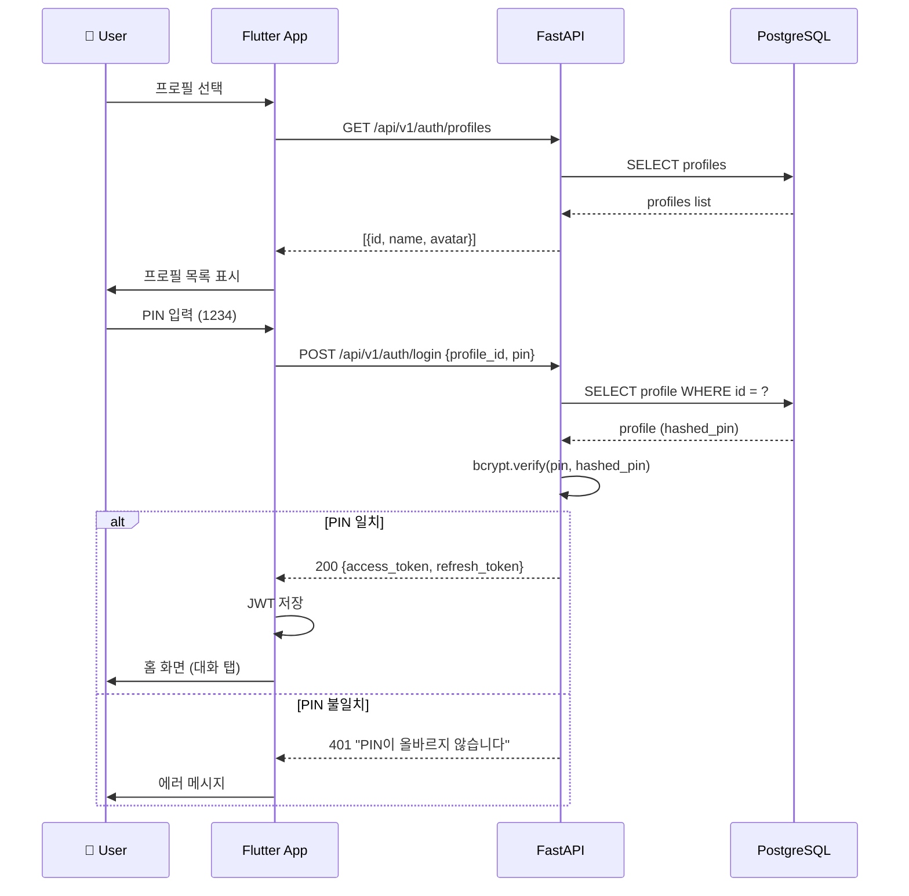
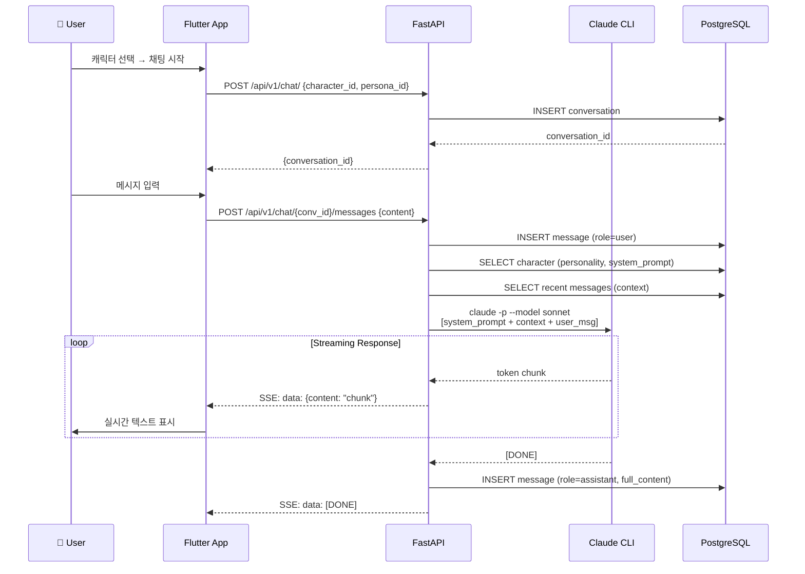
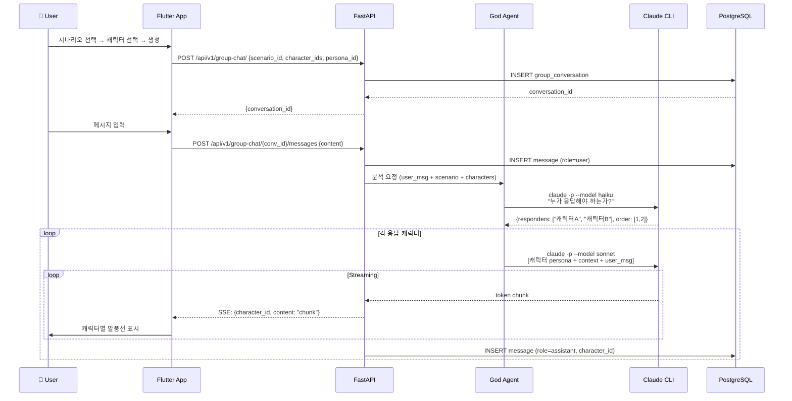
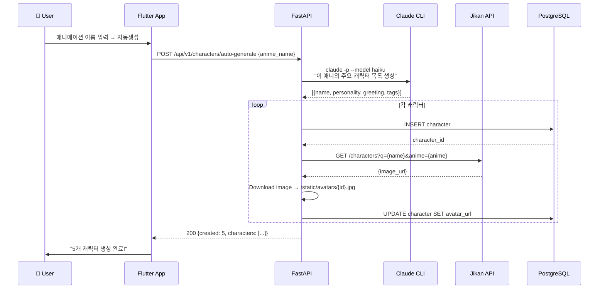
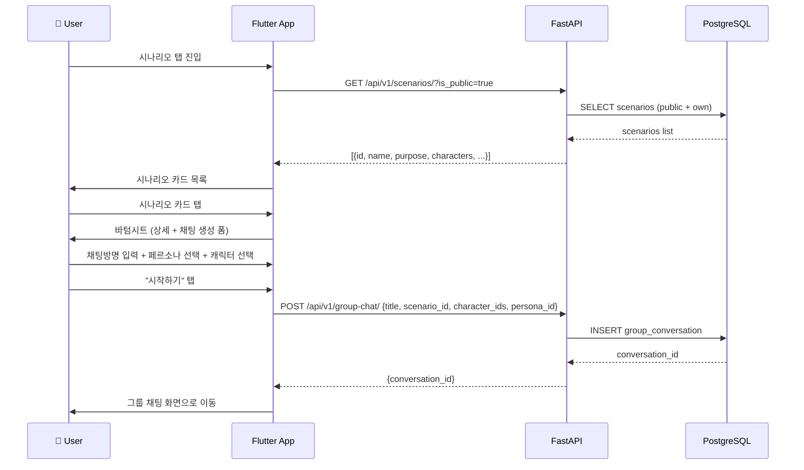
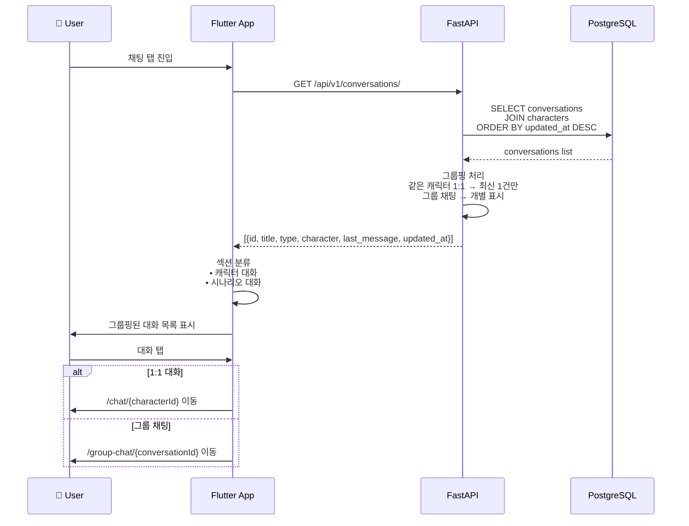
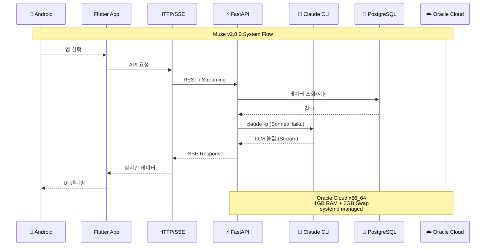

# Muse - Sequence Diagrams

## 1. PIN 로그인 플로우

```mermaid
sequenceDiagram
    participant U as 📱 User
    participant App as Flutter App
    participant API as FastAPI
    participant DB as PostgreSQL

    U->>App: 프로필 선택
    App->>API: GET /api/v1/auth/profiles
    API->>DB: SELECT profiles
    DB-->>API: profiles list
    API-->>App: [{id, name, avatar}]
    App->>U: 프로필 목록 표시

    U->>App: PIN 입력 (1234)
    App->>API: POST /api/v1/auth/login {profile_id, pin}
    API->>DB: SELECT profile WHERE id = ?
    DB-->>API: profile (hashed_pin)
    API->>API: bcrypt.verify(pin, hashed_pin)
    alt PIN 일치
        API-->>App: 200 {access_token, refresh_token}
        App->>App: JWT 저장
        App->>U: 홈 화면 (대화 탭)
    else PIN 불일치
        API-->>App: 401 "PIN이 올바르지 않습니다"
        App->>U: 에러 메시지
    end
```

## 2. 1:1 캐릭터 채팅 (Streaming)

```mermaid
sequenceDiagram
    participant U as 📱 User
    participant App as Flutter App
    participant API as FastAPI
    participant LLM as Claude CLI
    participant DB as PostgreSQL

    U->>App: 캐릭터 선택 → 채팅 시작
    App->>API: POST /api/v1/chat/ {character_id, persona_id}
    API->>DB: INSERT conversation
    DB-->>API: conversation_id
    API-->>App: {conversation_id}

    U->>App: 메시지 입력
    App->>API: POST /api/v1/chat/{conv_id}/messages {content}
    API->>DB: INSERT message (role=user)
    API->>DB: SELECT character (personality, system_prompt)
    API->>DB: SELECT recent messages (context)

    API->>LLM: claude -p --model sonnet<br/>[system_prompt + context + user_msg]

    loop Streaming Response
        LLM-->>API: token chunk
        API-->>App: SSE: data: {content: "chunk"}
        App->>U: 실시간 텍스트 표시
    end

    LLM-->>API: [DONE]
    API->>DB: INSERT message (role=assistant, full_content)
    API-->>App: SSE: data: [DONE]
```

## 3. 그룹 채팅 (God Agent)

```mermaid
sequenceDiagram
    participant U as 📱 User
    participant App as Flutter App
    participant API as FastAPI
    participant God as God Agent
    participant LLM as Claude CLI
    participant DB as PostgreSQL

    U->>App: 시나리오 선택 → 캐릭터 선택 → 생성
    App->>API: POST /api/v1/group-chat/ {scenario_id, character_ids, persona_id}
    API->>DB: INSERT group_conversation
    DB-->>API: conversation_id
    API-->>App: {conversation_id}

    U->>App: 메시지 입력
    App->>API: POST /api/v1/group-chat/{conv_id}/messages {content}
    API->>DB: INSERT message (role=user)

    API->>God: 분석 요청 (user_msg + scenario + characters)
    God->>LLM: claude -p --model haiku<br/>"누가 응답해야 하는가?"
    LLM-->>God: {responders: ["캐릭터A", "캐릭터B"], order: [1,2]}

    loop 각 응답 캐릭터
        God->>LLM: claude -p --model sonnet<br/>[캐릭터 persona + context + user_msg]
        loop Streaming
            LLM-->>API: token chunk
            API-->>App: SSE: {character_id, content: "chunk"}
            App->>U: 캐릭터별 말풍선 표시
        end
        API->>DB: INSERT message (role=assistant, character_id)
    end
```

## 4. 캐릭터 자동생성

```mermaid
sequenceDiagram
    participant U as 📱 User
    participant App as Flutter App
    participant API as FastAPI
    participant LLM as Claude CLI
    participant Jikan as Jikan API
    participant DB as PostgreSQL

    U->>App: 애니메이션 이름 입력 → 자동생성
    App->>API: POST /api/v1/characters/auto-generate {anime_name}

    API->>LLM: claude -p --model haiku<br/>"이 애니의 주요 캐릭터 목록 생성"
    LLM-->>API: [{name, personality, greeting, tags}]

    loop 각 캐릭터
        API->>DB: INSERT character
        DB-->>API: character_id

        API->>Jikan: GET /characters?q={name}&anime={anime}
        Jikan-->>API: {image_url}
        API->>API: Download image → /static/avatars/{id}.jpg
        API->>DB: UPDATE character SET avatar_url
    end

    API-->>App: 200 {created: 5, characters: [...]}
    App->>U: "5개 캐릭터 생성 완료!"
```

## 5. 시나리오 → 그룹채팅 생성 플로우

```mermaid
sequenceDiagram
    participant U as 📱 User
    participant App as Flutter App
    participant API as FastAPI
    participant DB as PostgreSQL

    U->>App: 시나리오 탭 진입
    App->>API: GET /api/v1/scenarios/?is_public=true
    API->>DB: SELECT scenarios (public + own)
    DB-->>API: scenarios list
    API-->>App: [{id, name, purpose, characters, ...}]
    App->>U: 시나리오 카드 목록

    U->>App: 시나리오 카드 탭
    App->>U: 바텀시트 (상세 + 채팅 생성 폼)

    U->>App: 채팅방명 입력 + 페르소나 선택 + 캐릭터 선택
    U->>App: "시작하기" 탭

    App->>API: POST /api/v1/group-chat/ {title, scenario_id, character_ids, persona_id}
    API->>DB: INSERT group_conversation
    DB-->>API: conversation_id
    API-->>App: {conversation_id}
    App->>U: 그룹 채팅 화면으로 이동
```

## 6. 대화 목록 조회 (그룹핑)

```mermaid
sequenceDiagram
    participant U as 📱 User
    participant App as Flutter App
    participant API as FastAPI
    participant DB as PostgreSQL

    U->>App: 채팅 탭 진입
    App->>API: GET /api/v1/conversations/
    API->>DB: SELECT conversations<br/>JOIN characters<br/>ORDER BY updated_at DESC
    DB-->>API: conversations list

    API->>API: 그룹핑 처리<br/>같은 캐릭터 1:1 → 최신 1건만<br/>그룹 채팅 → 개별 표시

    API-->>App: [{id, title, type, character, last_message, updated_at}]

    App->>App: 섹션 분류<br/>• 캐릭터 대화<br/>• 시나리오 대화
    App->>U: 그룹핑된 대화 목록 표시

    U->>App: 대화 탭
    alt 1:1 대화
        App->>U: /chat/{characterId} 이동
    else 그룹 채팅
        App->>U: /group-chat/{conversationId} 이동
    end
```

## 7. 전체 시스템 Overview

```mermaid
sequenceDiagram
    participant Phone as 📱 Android
    participant Flutter as Flutter App
    participant HTTP as HTTP/SSE
    participant FastAPI as ⚡ FastAPI
    participant Claude as 🤖 Claude CLI
    participant PG as 🐘 PostgreSQL
    participant OCI as ☁️ Oracle Cloud

    Note over Phone,OCI: Muse v2.0.0 System Flow

    Phone->>Flutter: 앱 실행
    Flutter->>HTTP: API 요청
    HTTP->>FastAPI: REST / Streaming

    FastAPI->>PG: 데이터 조회/저장
    PG-->>FastAPI: 결과

    FastAPI->>Claude: claude -p (Sonnet/Haiku)
    Claude-->>FastAPI: LLM 응답 (Stream)

    FastAPI-->>HTTP: SSE Response
    HTTP-->>Flutter: 실시간 데이터
    Flutter-->>Phone: UI 렌더링

    Note over FastAPI,OCI: Oracle Cloud x86_64<br/>1GB RAM + 2GB Swap<br/>systemd managed
```
